# TESTING

## Compatibility

In order to confirm the correct functionality, responsiveness, and appearance:

- My website was tested on the following browsers: Chrome, Firefox, Edge.

    + Chrome:

    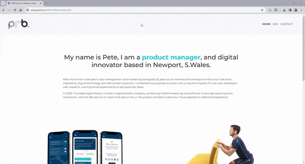

    + Firefox:

    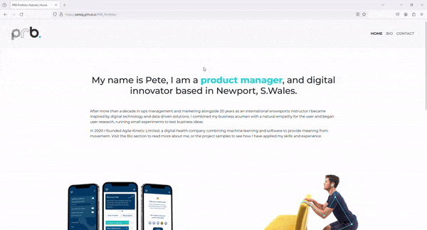

    + Edge:

    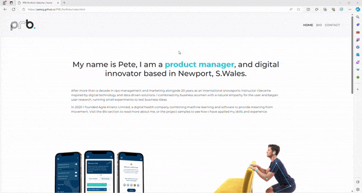

---

## Responsiveness

The website was checked using DevTools

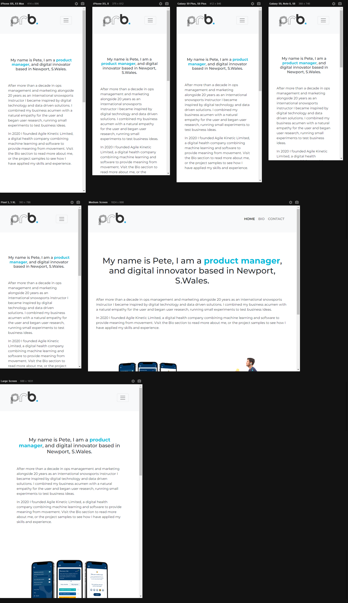

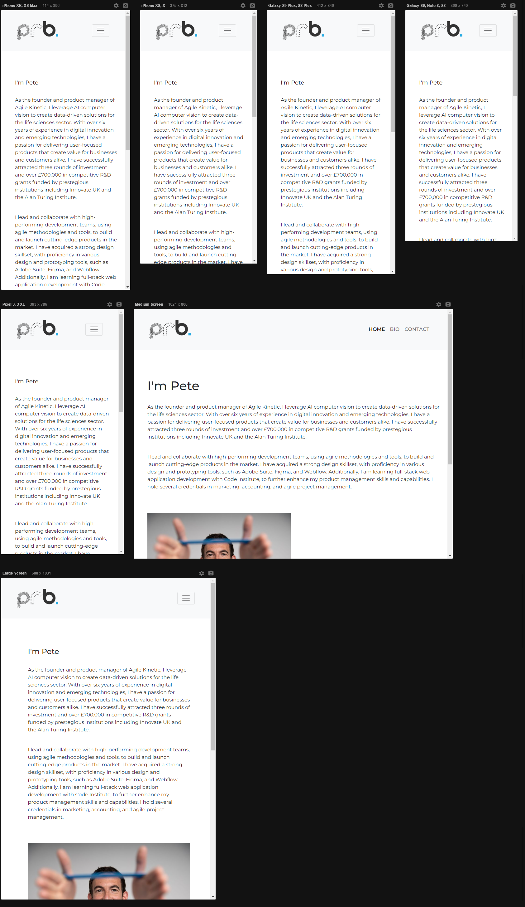

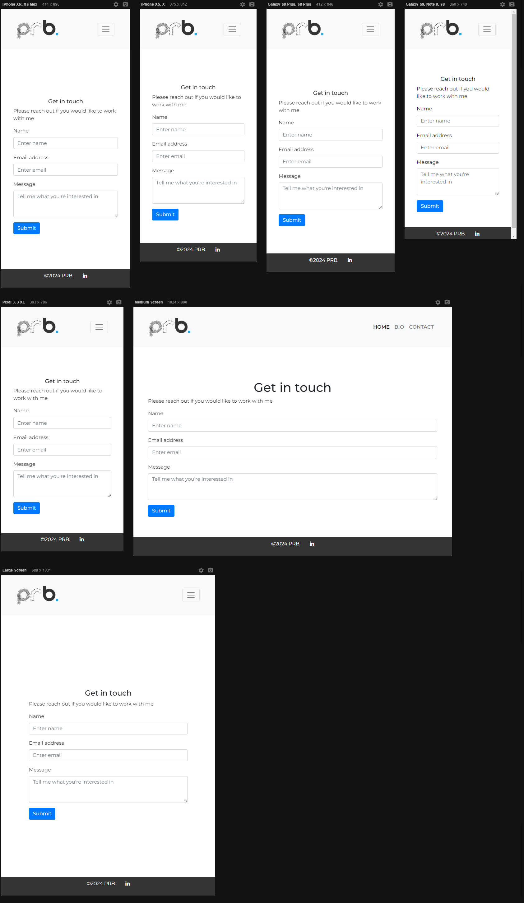

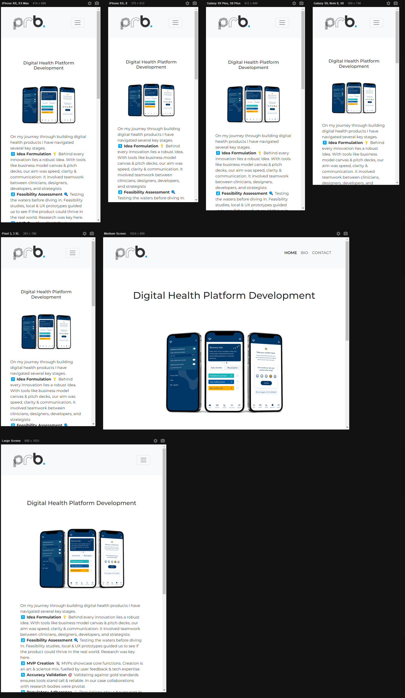

---

## User Stories
1.	As a tech recruiter, I want to easily understand Pete's core competencies and technical skills, so that I can quickly assess if he fits our company's needs.
•	Met by: Clear categorisation of skills and competencies in the homepage summary, specific project examples, and bio section.
2.	As a startup founder, I want to view examples of Pete's previous projects, including his role and contributions, to evaluate his experience and problem-solving abilities.
•	Met by: A 'Projects' section showcasing detailed case studies of key projects worked on.
3.	As a potential collaborator, I need to easily find Pete's contact information, so that I can reach out to him for potential partnerships or collaborative projects.
•	Met by: A visible 'Contact' section with more than one contact option, including a form, and LinkedIn.

---

## Manual Testing

feature                               | action                                                                     | expected result                             | tested | passed | comments                                                                                                             
------------------------------------- | -------------------------------------------------------------------------- | ------------------------------------------- | ------ | ------ | ---------------------------------------------------------------------------------------------------------------------
Navbar                                |                                                                            |                                             |        |        |                                                                                                                      
Home                                  | Click on the "Home" link                                                   | The user is redirected to the main page     | Yes    | Yes    | \-                                                                                                                   
Logo                                  | Click on the Logo                                                          | The user is redirected to the main page     | Yes    | Yes    |                                                                                                                      
Bio                                   | Click on the "Bio" link                                                    | The user is redirected to the bio page      | Yes    | Yes    | \-                                                                                                                   
Contact                               | Click on the "Contact" link                                                | The user is redirected to the contact page  | Yes    | Yes    | \-                                                                                                                   
Footer                                |                                                                            |                                             |        |        |                                                                                                                      
LinkedIn icon in the footer           | Click on the LinkedIn icon                                                 | The user is redirected to the LinkedIn page | Yes    | Yes    | \-                                                                                                                   
Home page                             |                                                                            |                                             |        |        |                                                                                                                      
"Read more" button under each project | Click on "Read More" under each project                                    | The user is redirected to the relevant page | Yes    | Yes    | \-                                                                                                                   
Contact page                          |                                                                            |                                             |        |        |                                                                                                                      
Name input                            | Enter the name                                                             | The name is entered                         | Yes    | Yes    | If user doesn't enter name, the error message appears                                                                
Email input                           | Enter the email                                                            | The email is entered                        | Yes    | Yes    | If user doesn't enter the email, the error message appears. If user enters not valid email, the error message appears
Message input                         | Enter the message                                                          | The message is entered                      | Yes    | Yes    | If user doesn't enter message, the error message appears                                                             
"Submit" button                       | Click on the "Submit" button                                               | The user is redirected to the response page | Yes    | Yes    | \-                                                                                                                   
Response page                         |                                                                            |                                             |        |        |                                                                                                                      
Response message                      | The user will be automatically redirected to the home page after 5 seconds | The user is redirected to the home page     | Yes    | Yes    | \-                                                                                                                   

---

## Validator Testing

### HTML
#### Homepage
No warnings or errors were shown when passing through the official W3C validator.
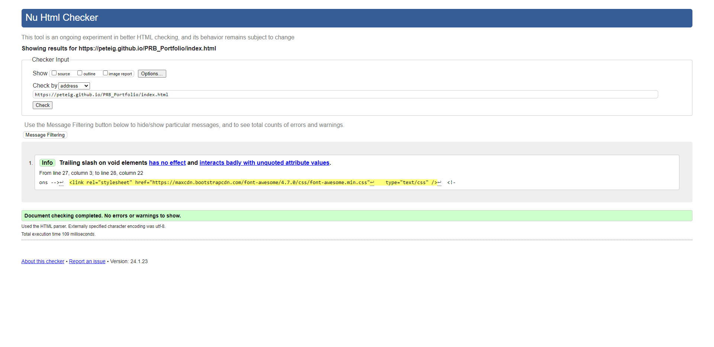

#### Bio Page
No warnings or errors were shown when passing through the official W3C validator.
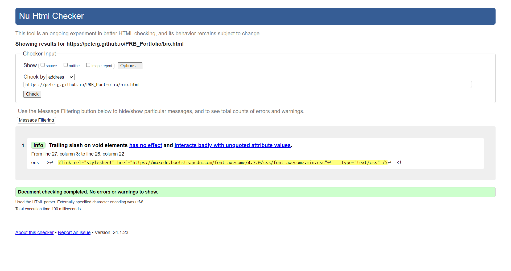

#### Contact Page
An unexplained error is occuring when passing through the official W3C validator. This is detailed in the 'bugs' section below

#### Project Page
No warnings or errors were shown when passing through the official W3C validator.
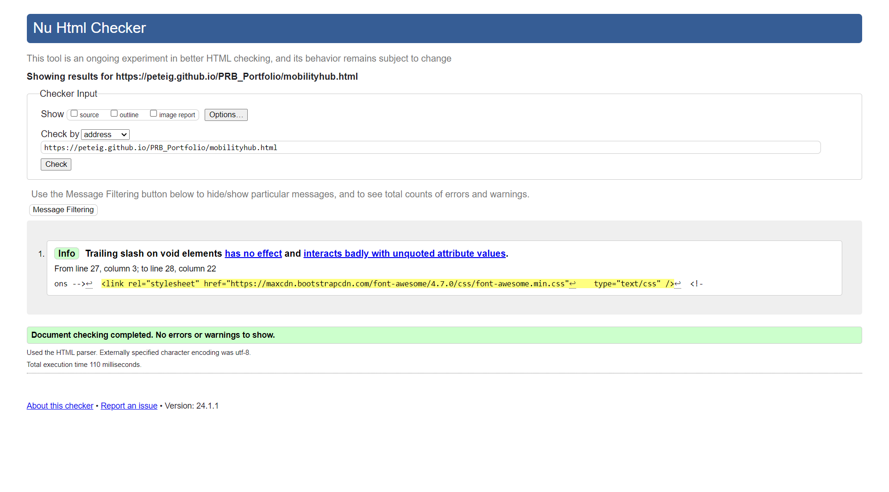

### CSS
No errors or warnings were found when passing through the official W3C (Jigsaw) validator
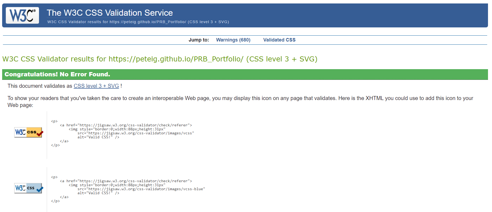

---

## LightHouse report

Using lighthouse in devtools I confirmed that the website is performing well, accessible and colors and fonts chosen are readable.

### Homepage
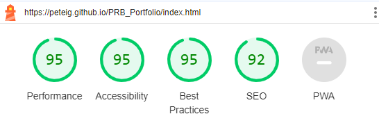

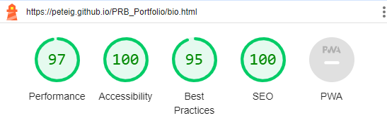

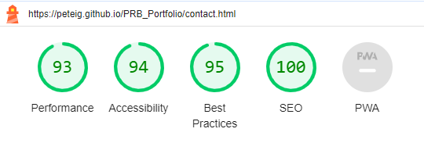

---

## Bugs

### Solved Bugs

* I had difficulty making the navbar sticky. The sticky-top class should have worked but did not. I could not find where in the code Bootstrap or CSS was overriding it. 

    + Resolved: I found the answer in Stackoverflow chat explaining that sticky-top will not work unless it is applied to the outermost element (which it wasn't), In this case, the class needed to be applied to the header, and not the nav element. This change has been applied and the bug is fixed.

* My wireframe links would not open for me, yet ther were accessible for other people on other machines. Even with a hard refresh I could not get them to show and the link kept navigating to Docs>Docs> despite my links being correct. 

    + Resolved: I had mistakenly placed the README.md file inside the docs folder. This bug now been fixed.

* There was a scaling issue with the work examples on the home page where, at medium screen sizes, the top row was splitting into two vertically stacked images while the second row remained horizontally stacked. 

    + Resolved: The issue had been caused by applying the 'a' tag to the outermost div rather than to the div containing the image. This fix has been made and the bug is resolved.

### Unsolved Bugs

* The official W3C validator flagged some issues in my form aria labels where I was mistakenly using aria-describedby. As shown in the devtools image below this label has been changed to an aria-label, changes were pushed to GitHub and the site was redeployed, yet the W3C validator continues to identify the same errors. 

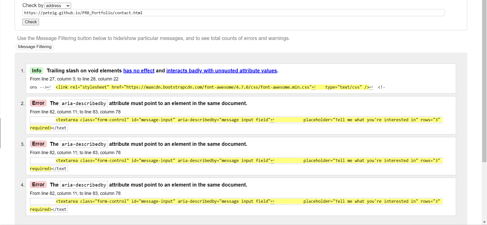

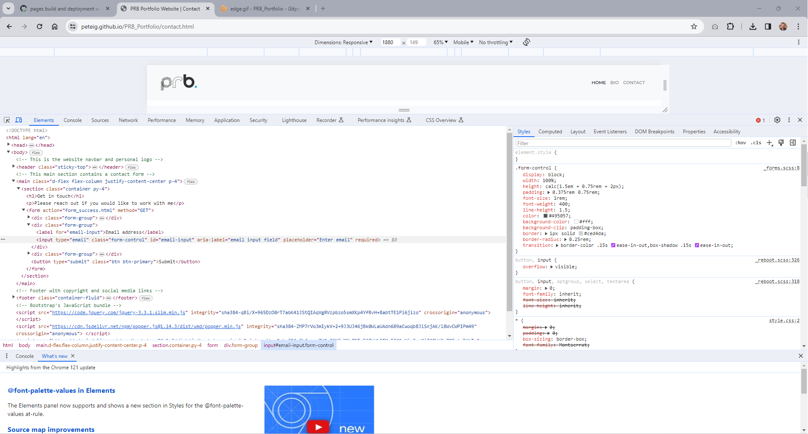

---

